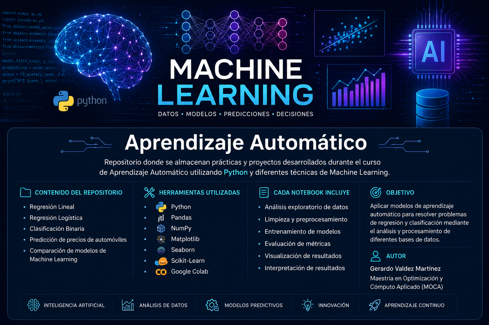

  

# 📘 Aprendizaje Automático

Repositorio donde se almacenan prácticas, proyectos y apuntes personales desarrollados durante el curso de Aprendizaje Automático utilizando Python y diferentes técnicas de Machine Learning.

---

## 📚 Contenido del repositorio

### 🧪 Prácticas y proyectos
- Regresión Lineal
- Regresión Logística
- Clasificación Binaria
- Regresión Polinomial
- Predicción de precios de automóviles
- Comparación de modelos de Machine Learning

### 📓 Apuntes personales
- 📘 Mis_Apuntes_Aprendizaje_Automatico.ipynb

---

## 🛠️ Herramientas utilizadas

- Python
- Pandas
- NumPy
- Matplotlib
- Seaborn
- Scikit-Learn
- Google Colab

---

## 🎯 Objetivo

Aplicar modelos de aprendizaje automático para resolver problemas de regresión y clasificación mediante el análisis, procesamiento e interpretación de diferentes bases de datos.

---

## 📂 Estructura del proyecto

Cada notebook incluye:

- Análisis exploratorio de datos
- Limpieza y preprocesamiento
- Entrenamiento de modelos
- Evaluación de métricas
- Visualización de resultados
- Interpretación de resultados
- Observaciones y conclusiones personales

---

## 🚀 Temas vistos

- Vectorización con NumPy
- Descenso del Gradiente
- Learning Rate
- Regresión Lineal
- Regresión Múltiple
- Escalamiento de variables
- Feature Engineering
- Regresión Polinomial
- Uso de Scikit-Learn
- Evaluación de modelos

---

## 👨‍💻 Autor

Gerardo Valdez Martínez  
Maestría en Optimización y Cómputo Aplicado (MOCA)

---

## 📌 Nota

Este repositorio tiene fines académicos y de aprendizaje, por lo que algunos notebooks incluyen comentarios, observaciones y apuntes personales realizados durante el desarrollo de las prácticas.
